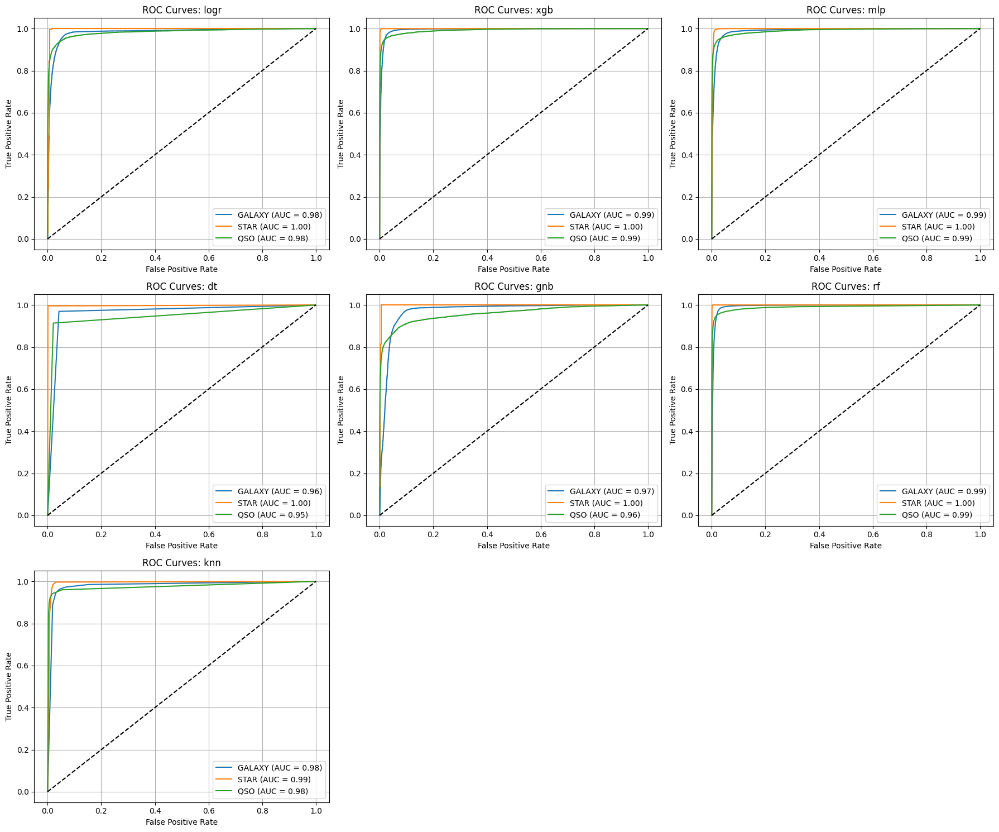
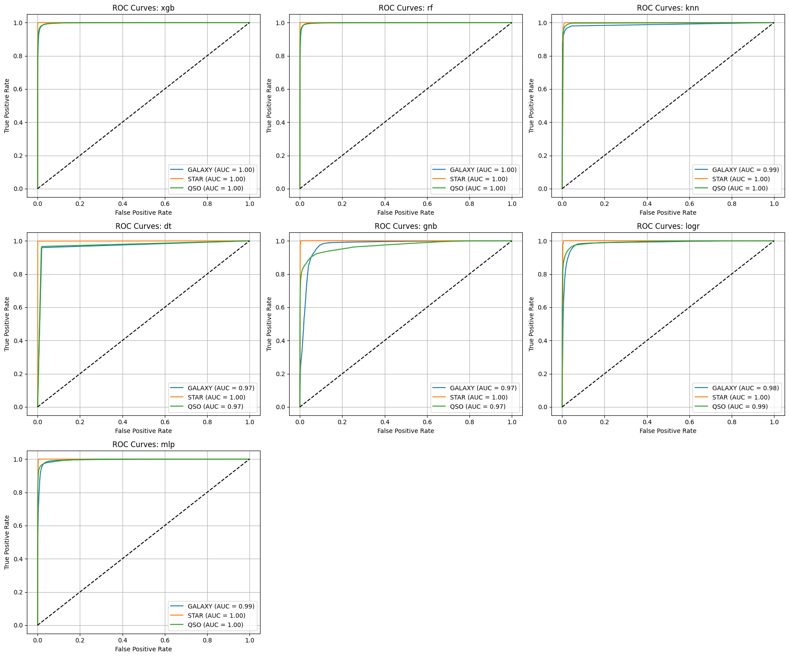

This project evaluates the use of different algorithms for classifying observations as stars, galaxies or quasars. The following methods are used:
- Logistic regression
- Naive Bayes
- Gradient boosting (XGBoost)
- Multilayer perceptron
- Decision tree
- Random forrest
- K-nearest neighbours

XGBoost, random forrest and MLP were the strongest methods, with random forrest giving the best overall results. 

Tackling the class imbalance using augmentation with SMOTE further improved results across all methods.

# Results

Results across all algorithms before (above) and after (below) augmentation:

<p float="left">
  
   
</p>

Classification report for random forrest before augmentation:


              precision    recall  f1-score   support

      GALAXY       0.98      0.99      0.98     35694
        STAR       0.99      1.00      1.00     12991
         QSO       0.96      0.93      0.94     11315

    accuracy                           0.98     60000
    macro avg      0.98      0.97      0.97     60000
    weighted avg   0.98      0.98      0.98     60000


Classification report for random forrest after augmentation:


              precision    recall  f1-score   support

      GALAXY       0.97      0.98      0.98     34758
        STAR       1.00      1.00      1.00     34758
         QSO       0.98      0.97      0.98     34758

    accuracy                           0.98    104274
    macro avg      0.98      0.98      0.98    104274
    weighted avg   0.98      0.98      0.98    104274


# Dataset

The dataset used is release 17 from the Sloan Digital Sky survey (link below). The dataset are categorised into classes `GALAXY`, `STAR` and `QSO`, and contains 100'000 observations described by a total of 18 attributes.

Dataset available:
https://www.kaggle.com/datasets/fedesoriano/stellar-classification-dataset-sdss17?resource=download

SDSS-17 ref: 
https://www.sdss4.org/dr17/


To run notebooks, first clone:
```
git clone https://github.com/morleythomas/celestial_classification.git
```

Then create environment:
```
python3.10 -m venv scc
```

Then, set up notebooks using the environment:
```
source scc/bin/activate
pip install --upgrade pip
pip install -r requirements.txt
python -m ipykernel install
```

